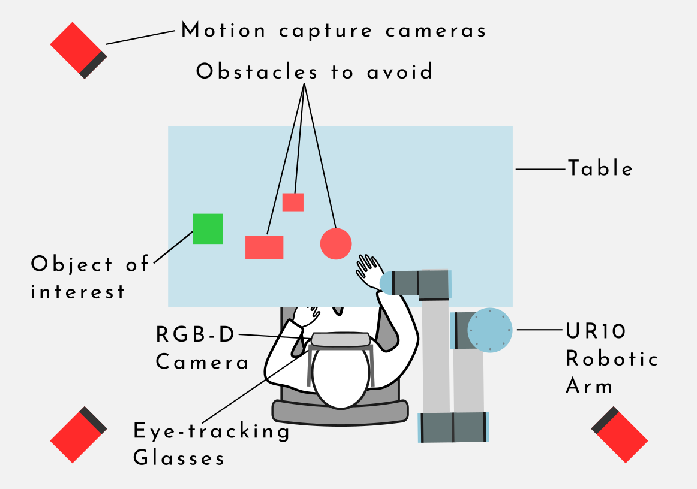
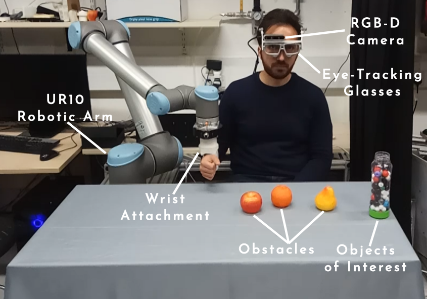
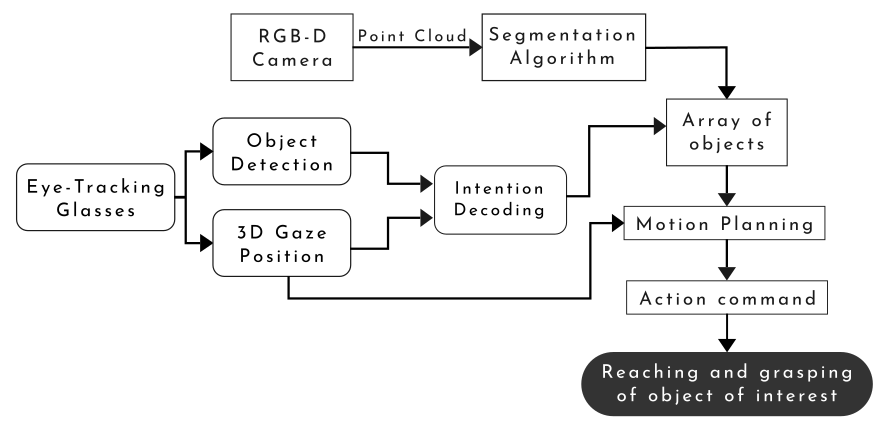
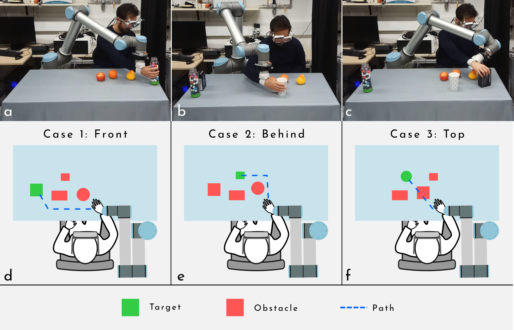

# Kinematics-aware assistive robotics for reach and grasp support in cluttered environments

Project delivered for MEng in Biomedical Engineering in 2018/19, Imperial College London.

- Project author: Nuno Caldeira Gaio Pereira
- Supervisor: [Dr Aldo Faisal](https://www.imperial.ac.uk/people/a.faisal)
- Co-Supervisor: Dr Ali Shafti
- Contact: nunocgpereira@gmail.com

This project presents a novel method to model the kinematics of human-robot interactions for obstacle avoidance during reaching and grasping tasks.
The project used the UR10 (from Universal Robots), RGB-D camera from Realsense, eye-tracking glasses, and Optitrack for motion tracking.

## Description
Overview of the experimental setup:



A person is sitting in front of a table with it's wrist attached to a robotic arm. The user is also wearing eye-tracking glasses with an RGB-D (depth) camera attached. On the table there are multiple objects. When the person wants to grasp an object, 
This will trigger the mapping algorithm that segments the point cloud obtained from the camera and creates a 3D map of the table. The object of interest is identified by using the 3D gaze position calculated with the eye-tracking glasses (i.e. where the person is looking at).
The main path planner controller then tries to find a safe and collision-free path that allows the person to grasp the object of interest without colliding with any of the obstacles.


The following diagram shows an overview of the entire algorithm procedure.


The algorithm was composed by three different planning strategies that allowed to grasp the objects from the front, from behind and from the top:


(Please note this is a bird's eye view description, please contact me for any further information)


### Installation Guide
This project was developed in ROS Indigo with Ubuntu 14.04, and partially tested with ROS Kinetic and Ubuntu 16.04

##### Dependencies
Create a new catkin workspace
Dependencies and packages required:
 - [Intel SDK (2.0)](https://github.com/IntelRealSense/librealsense)
 - [realsense_camera](https://github.com/IntelRealSense/realsense-ros)
 - [universal_robots](https://github.com/ros-industrial/universal_robot)
 - [ur_modern_driver](https://github.com/ros-industrial/ur_modern_driver)
 - [natnet_ros](https://github.com/mje-nz/natnet_ros)
 - [natnet_msgs](https://github.com/ros-drivers/mocap_optitrack/blob/master/src/natnet/natnet_messages.cpp)
 - [moveit_python](http://wiki.ros.org/moveit_python) - packages to enable changing the colour of the objects in the planning scene

main_package install dependencies:
 - rospy    
 - roscpp    
 - pcl_ros
 - pcl_conversions

##### Package installation Guide:
1. Create a new catkin workspace and install all the dependencies and packages listed above
2. Copy “nuno_package” into the catkin workspace “src” folder
3. Copy “ur10.srdf” into universal_robot > ur10_moveit_config > config
4. Copy “ur10.urdf.xacro” into universal_robot > ur_description > urdf
5. Catkin_make

To use the code with the robot use the following launch files:
```sh
$ roslaunch ur_modern_driver ur10_bringup_joint_limited.launch robot_ip:=192.168.1.102
2. roslaunch ur10_moveit_config ur10_moveit_planning_execution.launch limited:=true
3. roslaunch nuno_package experiment.launch
4. Send a gaze point by running (where x y z are the coordinates of the gaze point):
		rosrun nuno_package gaze_client.py  x  y  z
5. Type “y” or “n” to execute the plan found
```


License
----

MIT
